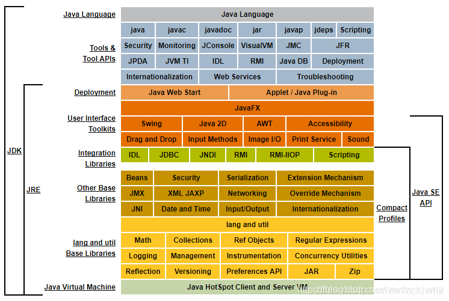

## 

Java语言和JDK工具

`
  Java是一种跨平台、面向对象的程序设计语言

  JDK是编译和执行Java程序的一种必备工具箱
`

#### JSE、JEE、JME
`
  Java有三个不同版本：

  Java SE：Standard Edition

  Java EE：Enterprise Edition

  Java ME：Micro Edition

  ┌───────────────────────────┐
  │Java EE                    │
  │    ┌────────────────────┐ │
  │    │Java SE             │ │
  │    │    ┌─────────────┐ │ │
  │    │    │   Java ME   │ │ │
  │    │    └─────────────┘ │ │
  │    └────────────────────┘ │
  └───────────────────────────┘

`

#### JDK、JRE、JVM

`
JDK：Java Development Kit
JRE：Java Runtime Environment
JVM：Java Virtual Machine

  ┌─    ┌──────────────────────────────────┐
  │     │     Compiler, debugger, etc.     │
  │     └──────────────────────────────────┘
 JDK ┌─ ┌──────────────────────────────────┐
  │  │  │                                  │
  │ JRE │      JVM + Runtime Library       │
  │  │  │                                  │
  └─ └─ └──────────────────────────────────┘
        ┌───────┐┌───────┐┌───────┐┌───────┐
        │Windows││ Linux ││ macOS ││others │
        └───────┘└───────┘└───────┘└───────┘

`

#### 关于版本选择

`
1、2019年1月Oracle宣布Java8开始收费了，JDK 8u211版本(包含)开始收费了。

2、从Java9开始，基本就是每半年一个版本，这个更新速度，导致很多企业没法跟随。因为迁移升级都有成本。

3、从Java8后续升级的很多版本拥有的新功能大部分都用不上。

4、Oracle必尽是个商业公司与之前的Sun理念不一样，灵魂级人物高斯林及sun的元老们也慢慢离开了Oracle公司。目前很多企业还在使用JDK8，当然现在Oracle推出的免费版本JDK17相信这种局面应该会有所改变。

`
