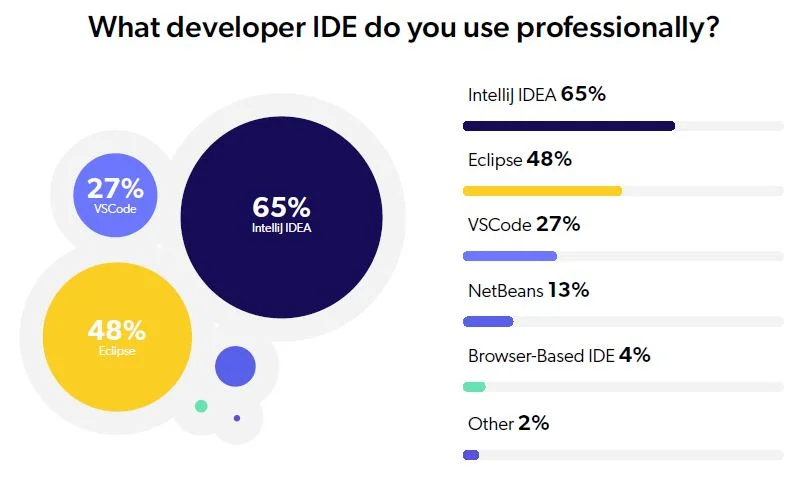

## Java常用IDE介绍

Introduction to commonly used IDEs for Java

`
The 3 Best Java IDEs to Use in 2022
Ranking the best Java IDEs is difficult, especially when it comes to crowning the out and out top choice. The top two choices for Java developers are typically IntelliJ IDEA and Eclipse, with industry usage typically skewing toward IntelliJ IDEA.

In our most recent Java Developer Productivity Report, respondents reported their IDE usage as follows:

IntelliJ IDEA: 65%
Eclipse: 48%
VSCode: 27%
NetBeans: 13%
Browser-based IDE: 4%
Other: 2%

`